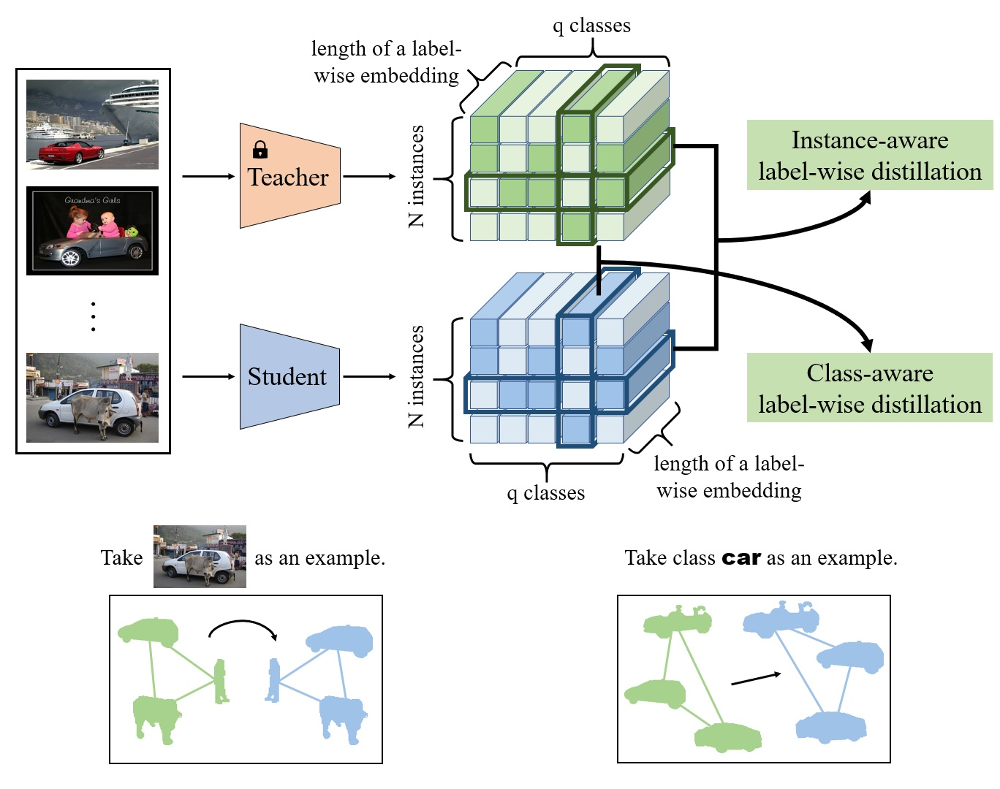

<p align="center">

<h1 align="center">Multi-Label Knowledge Distillation</h1>
  <p align="center">
    <a href="https://phyang.top/"><strong>Penghui Yang</strong></a>
    ·
    <a href="https://www.xiemk.pro/"><strong>Ming-Kun Xie</strong></a>
    ·
    <a href="https://chenchenzong.github.io/"><strong>Chen-Chen Zong</strong></a>
    ·
    <a href="https://lfeng-ntu.github.io/"><strong>Lei Feng</strong></a>
    ·
    <a href="https://niug1984.github.io/"><strong>Gang Niu</strong></a>
    ·
    <a href="http://www.ms.k.u-tokyo.ac.jp/sugi/index.html/"><strong>Masashi Sugiyama</strong></a>
    ·
    <a href="http://parnec.nuaa.edu.cn/huangsj/"><strong>Sheng-Jun Huang</strong></a>
  </p>
  <h2 align="center">ICCV 2023 Conference Proceedings</h2>
</p>

<div align=center><\div>

## Requirements

The repo is tested with:

> - mmcv==1.3.15
> - numpy==1.21.2
> - Pillow==9.2.0
> - randaugment==1.0.2
> - scikit_learn==1.1.2
> - timm==0.6.7
> - torch==1.8.1
> - torchvision==0.9.1

But it should be runnable with other PyTorch versions.

To install requirements:

```
pip install -r requirements.txt
```

## Quick start

You can train on MS-COCO with default settings stored in `./configs/coco/resnet101_to_resnet34_l2d.py`:

```
python main.py --cfg_file ./configs/coco/resnet101_to_resnet34_l2d.py --data_root [file path of MS-COCO stored on your own device]
```

You can also try your own distillers and other options by making your own configuration files under the guidance of [Configuration files](#configuration-files).

## Use your own dataset

Your Pascal VOC 2007 dataset folder should be like this:

```
[Any name you want]
  |--VOCtrainval2007
    |--VOCdevkit
      |--VOC2007
        |--JPEGImages
          |--000005.jpg
          |--...
        |--ImageSets
          |--Main
            |--trainval.txt
  |--VOCtest2007
    |--VOCdevkit
      |--VOC2007
        |--JPEGImages
          |--000001.jpg
          |--...
        |--ImageSets
          |--Main
            |--test.txt
```

Your MS-COCO 2014 dataset folder should be like this:

```
[Any name you want]
  |--train2014
    |--COCO_train2014_000000000009.jpg
    |--...
  |--val2014
    |--COCO_val2014_000000000042.jpg
    |--...
  |--train_anno.json
  |--val_anno.json
```

`train_anno.json` and `val_anno.json` are in the fold `./appendix`.

Your NUS-WIDE dataset folder should be like this:

```
[Any name you want]
  |--Flickr
    |--actor
      |--0001_2124494179.jpg
      |--0002_174174086.jpg
      |--...
    |--administrative_assistant
      |--0001_534152430.jpg
      |--0002_258761806.jpg
      |--...
    |--...
  |--ImageList
    |--Imagelist.txt
    |--TrainImagelist.txt
    |--TestImagelist.txt
  |--TrainTestLabels
    |--Labels_airport_Train.txt
    |--Labels_airport_Test.txt
    |--...
  |--Concepts81.txt
```

All codes of the data processing part are in the fold `./data`, and you can replace them with your own code.

## Configuration files

We use configuration files to pass parameters to the program. An example in the fold `./configs` is shown below:

```python
dataset = "coco"
teacher_pretrained = False
img_size = 224
batch_size = 64

model_t = "resnet101"
lr_t = 1e-4
max_epoch_t = 80
stop_epoch_t = 30

model_s = "resnet34"
lr_s = 1e-4
max_epoch_s = 80
stop_epoch_s = 80

criterion_t2s_para = dict(
    name="L2D",
    para=dict(
        lambda_ft=0.0,
        ft_dis=None,
        lambda_le=1.0,
        le_dis=dict(
            name="LED",
            para=dict(
                lambda_cd=100.0,
                lambda_id=1000.0
            )
        ),
        lambda_logits=10.0,
        logits_dis=dict(
            name="MLD",
            para=dict()
        )
    )
)
```

We split a distiller into three parts: feature-based part, label-wise embedding part and logits-based part. Each part has a balancing parameter lambda and corresponding parameters.
